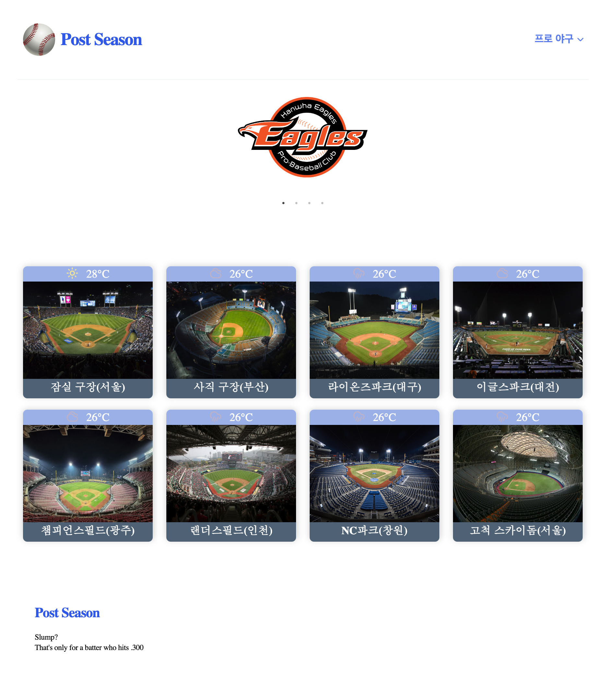
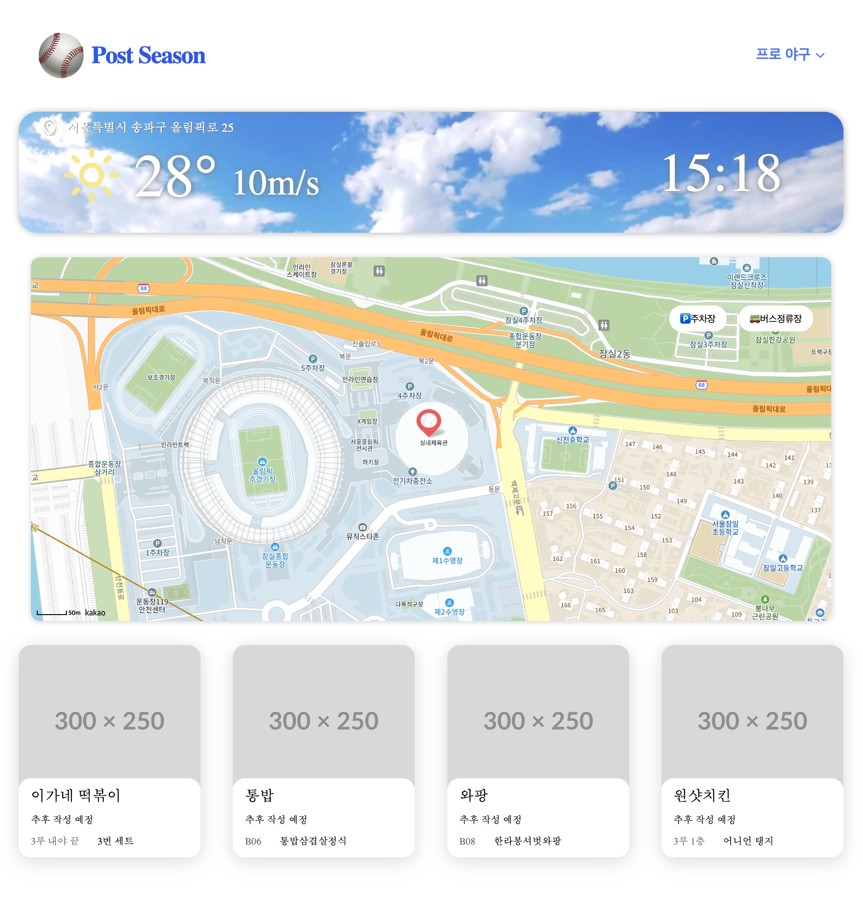

# Hackarthon 프로젝트
### PostSeason 팀
    윤해진(팀장), 윤예진, 이재용
## 프로젝트 개요
    야구 경기장별 날씨, 정보를 제공하는 서비스
## 기획
- ### 개발 동기
        평소 야구 경기 관람을 위해 경기장을 자주 찾는 편입니다.
        '자리어때' 라는 경기장 좌석현황 조회 서비스를 사용하고 있었는데,
        자리 외의 정보는 제공되지 않아 경기장별 날씨, 위치, 대중교통 정보 등
        다양한 정보를 제공하는 서비스를 기획하게 되었습니다.
    
- ### 기능
  - 구장별 날씨 정보 제공
  - 경기장 지도 및 주변시설(주차장, 버스 정류장) 정보 제공
  - 경기장 근처 음식점 정보 제공

## 기술
- ### 기술 스택
  - React + Vite
  - React Router
  - Eslint, Stylelint
- ### 사용 API
  - React Kakao Maps SDK
  - 기상청 동네에보조회 서비스
  - 주차장
  - 버스 정류장(2개)

## 구현
- ### MainPage
     
- ### DetailPage
    

